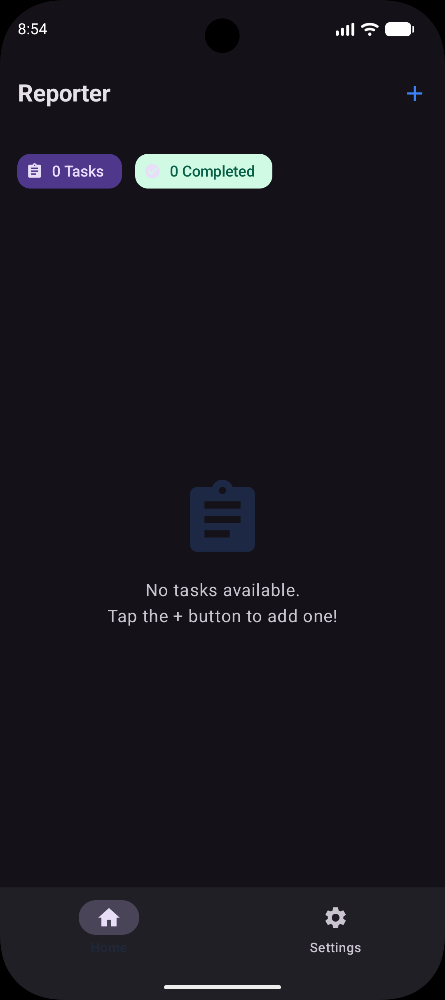
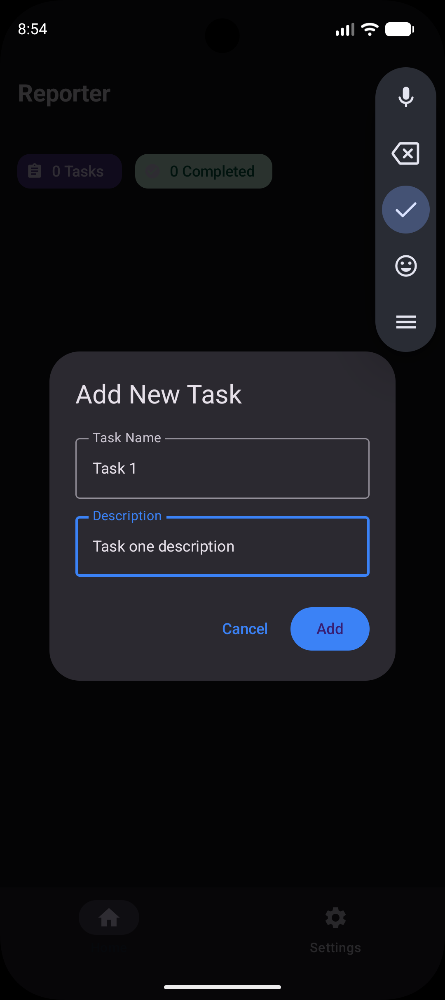
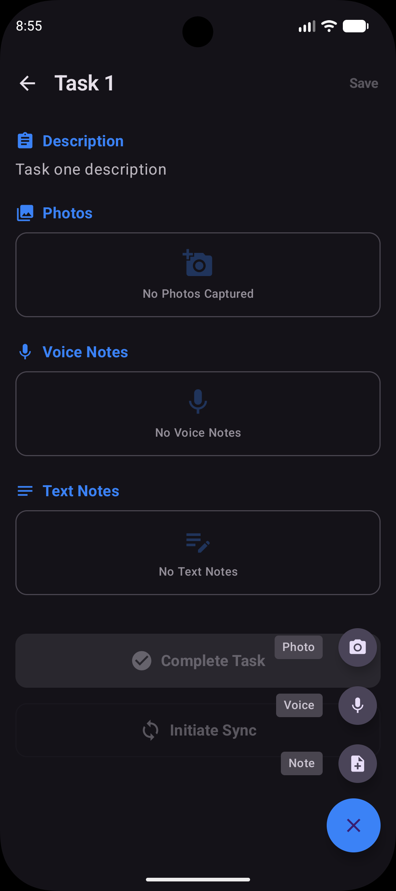
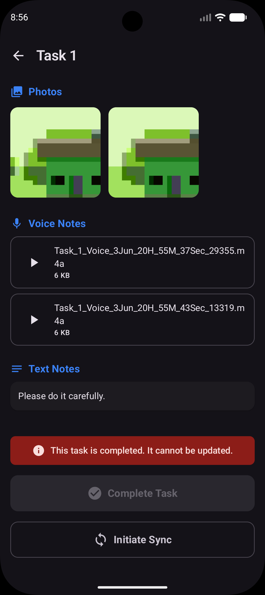
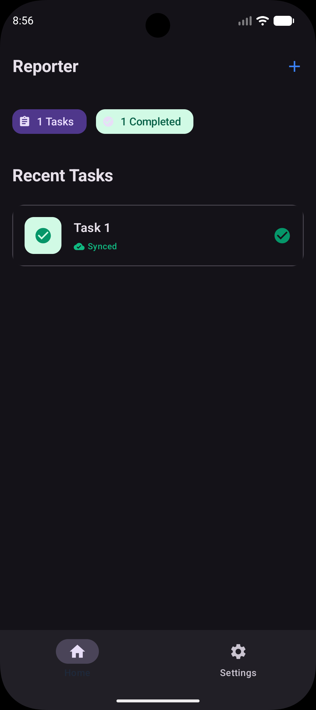

# Field Work Reporter

Field Work Reporter is a modern Android application designed for field professionals to capture and organize task-related data efficiently. It allows users to create tasks and attach rich media including photos, voice recordings, and text notes, all within a clean and intuitive interface.

## Screenshots

  
  
  

  
  
  

## Key Features

- **Task Management**: Create and track tasks with titles and descriptions.
- **Rich Media Attachments**:
    - **Photos**: Capture field images directly using the camera.
    - **Voice Notes**: Record audio feedback or site observations.
    - **Text Notes**: Write detailed notes for each task.
- **Task Lifecycle**: Support for "Draft" and "Completed" states. Completed tasks are locked to prevent accidental updates.
- **Offline First**: All data is stored locally using Room database, ensuring functionality without an internet connection.
- **Cloud Synchronization**: Automated and manual sync to Cloud Firestore.
- **Type-Safe Navigation**: Modern navigation flow using Kotlinx Serialization.
- **Professional UI**: Clean, eye-catchy Material 3 design with a professional Slate & Indigo color palette.

## Sync Process & Architecture

The application implements a robust synchronization mechanism to ensure field data is securely backed up to the cloud.

### 1. WorkManager Integration
The app utilizes **Android Jetpack WorkManager** for background synchronization:
- **Periodic Sync**: Automatically schedules a sync every 15 minutes (when the network is available).
- **Immediate Sync**: Triggered instantly when a user marks a task as "Completed" or manually clicks the "Initiate Sync" button.
- **Reliability**: Uses `BackoffPolicy.EXPONENTIAL` to handle transient network failures and retries gracefully.

### 2. Firestore Storage Strategy (No Firebase Storage)
To optimize for specific subscription constraints, the app uses a custom binary-to-string sync strategy:
- **Base64 Encoding**: Media files (Photos and Voice Notes) are read from local storage and encoded into Base64 strings.
- **Single Document Sync**: All task details, including the Base64-encoded media, are stored within a single Cloud Firestore document under the `mediaData` field.
- **Size Consideration**: Designed for small media snippets, adhering to Firestore's 1MB document size limit.

### 3. Hilt Worker Injection
The `SyncWorker` is integrated with **Dagger Hilt** using `@HiltWorker` and `@AssistedInject`. This allows the worker to access `TaskDao` and `FirebaseFirestore` instances seamlessly within the background process.

## Tech Stack

- **Language**: [Kotlin](https://kotlinlang.org/)
- **UI Framework**: [Jetpack Compose](https://developer.android.com/jetpack/compose)
- **Background Tasks**: [WorkManager](https://developer.android.com/topic/libraries/architecture/workmanager)
- **Backend**: [Cloud Firestore](https://firebase.google.com/docs/firestore)
- **Dependency Injection**: [Hilt](https://developer.android.com/training/dependency-injection/hilt-android)
- **Database**: [Room](https://developer.android.com/training/data-storage/room)
- **Image Loading**: [Coil 3](https://coil-kt.github.io/coil/)
- **Navigation**: [Jetpack Navigation Compose](https://developer.android.com/guide/navigation/navigation-getting-started)

## Project Structure

- **`data`**: Room entities, DAOs, and the Repository implementation.
- **`sync`**: WorkManager `SyncWorker` and `SyncScheduler` for background orchestration.
- **`presentation`**: UI layer (HomeScreen, TaskDetailScreen) using Compose and MVVM.
- **`util`**: File management and Base64 utilities.

## Getting Started

1. Clone the repository.
2. Ensure you have a `google-services.json` file in the `app/` directory.
3. Open in Android Studio (Ladybug or newer).
4. Sync Gradle and Run on an emulator or physical device (API 26+).
